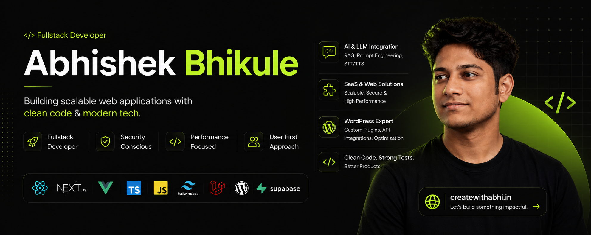

  

  
  
  
  

---

### 🚀 What I'm building right now

- **Powerful Docs** — AI support-bot SaaS. RAG retrieval, prompt tuning, multi-source ingestion (websites + FreeScout helpdesk), embeddable widget with persistent chat threading.
- **SureFeedback** — multi-tenant feedback SaaS. Shipped GitHub, Jira, Slack, Zapier, OttoKit, and SureCart integrations end-to-end (OAuth, webhooks, 2-way sync).
- **WordPress plugins** — maintainer on Convert Pro, Convert Pro Addon, Astra Portfolio, Project Huddle, BB Ultimate Addon, WP Schema Pro (combined 2M+ active installs).

### 🧪 Side projects worth a click

- **[medical-report-companion](https://github.com/Bhikule19/medical-report-companion)** — multilingual (14 languages) AI medical-report explainer. Next.js 15 + Supabase Edge Functions + Deepgram STT/TTS + Google OAuth.
- **[designmd-extractor](https://github.com/Bhikule19/designmd-extractor)** — paste any URL, get a deterministic `DESIGN.md` (colour tokens, typography, spacing). Cite-first transparency; no LLM in the default path.
- **[DocEase](https://github.com/Bhikule19/DocEase)** — AI document simplification with voice synthesis (10 languages) and Recharts data viz.

### 💻 Tech I work with

**Frontend**

**Backend & Data**

**AI & Integrations**

&nbsp;`RAG` · `Prompt Engineering` · `OAuth 2.0` · `Webhooks` · `REST APIs` · `Deepgram STT/TTS`

**WordPress**

&nbsp;`WPCS` · `Plugin Development` · `Abilities API` · `Block Editor`

**Tooling**

---

### 📊 GitHub Stats

### 📫 Reach me

- ✉️ &nbsp;**abhishekbhikule76@gmail.com**
- 💼 &nbsp;[linkedin.com/in/abhishek-bhikule](https://www.linkedin.com/in/abhishek-bhikule/)
- 🌐 &nbsp;[Portfolio](https://www.createwithabhi.in/)

